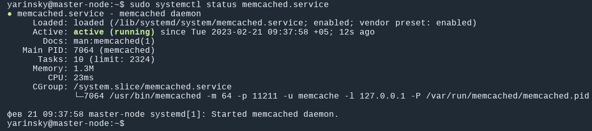
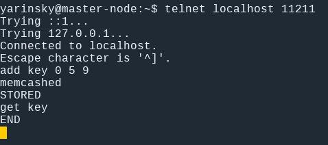
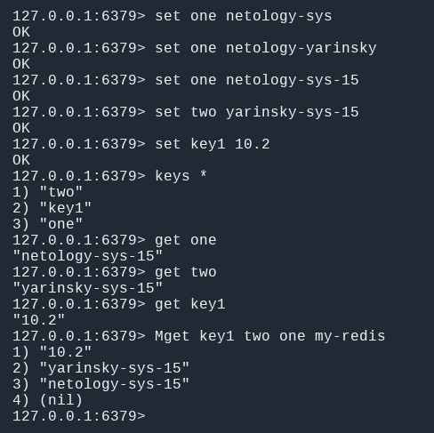
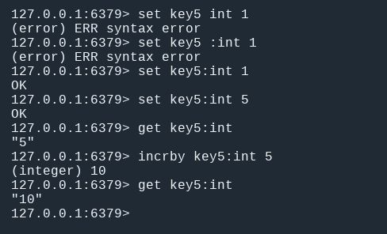

# Домашнее задание к занятию 11.2 "`Кеширование Redis/memcached`" - `Яринский Д.А.`

## Задание 1 - `Кэширование`

Приведите примеры проблем, которые может решить кеширование.

***Приведите ответ в свободной форме.***

## Ответ:

Запросы к базам данных могут быть медленными и требовать серьёзных системных ресурсов, так как серверу баз данных, для формирования ответа, 
нужно выполнять вычисления. 

Кэширование позволяет увеличивать производительность за счёт использования сохранённых ранее данных, вроде ответов на сетевые запросы или 
результатов вычислений. Благодаря кэшу, при очередном обращении клиента за одними и теми же данными, сервер может обслуживать запросы быстрее.

Кэшировать можно и вцелом нужно данные, которые медленно генерируются и часто запрашиваются:

  - Результаты запросов к внешним сервисам; 
  - Результаты медленных выборок из базы данных; 
  - Сгенерированные html блоки либо целые страницы; 

При обновлении особенно тяжелых данных следует использовать не сброс кэша, а прямое обновление данных в нем - это позволит избежать дополнительной нагрузки 
при выполнении тяжелых выборок, когда ключ удаляется. 

Допустим при добавлении новых пользователей, вместо сброса счетчика и повторной выборки, можно просто увеличить значение кэша на единицу.

## Задание 2 - `memcached`

Установите и запустите memcached.

***Приведите скриншот systemctl status memcached, где будет видно, что memcached запущен.***

## Ответ:

---

## Задание 3 - `Удаление по TTL в Memcached`

Запишите в memcached несколько ключей с любыми именами и значениями, для которых выставлен TTL 5.

***Приведите скриншот, на котором видно, что спустя 5 секунд ключи удалились из базы.***

## Ответ:

---

## Задание 4 - `Запись данных в Redis`

Запишите в Redis несколько ключей с любыми именами и значениями.

***Через redis-cli достаньте все записанные ключи и значения из базы, приведите скриншот этой операции.***

## Ответ:

# Дополнительные задания (со звездочкой*)

## Задание 5 -`Работа с числами`

Запишите в Redis ключ key5 со значением типа "int" равным числу 5. Увеличьте его на 5, чтобы в итоге в значении лежало число 10.

***Приведите скриншот, где будут проделаны все операции и будет видно, что значение key5 стало равно 10.***

## Ответ:

---
