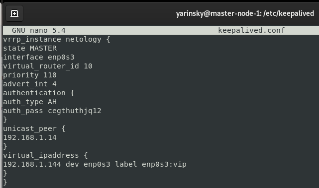
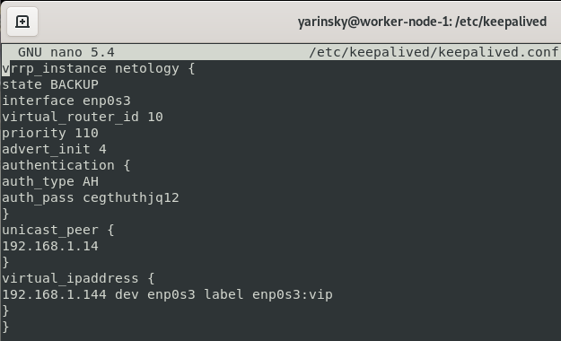
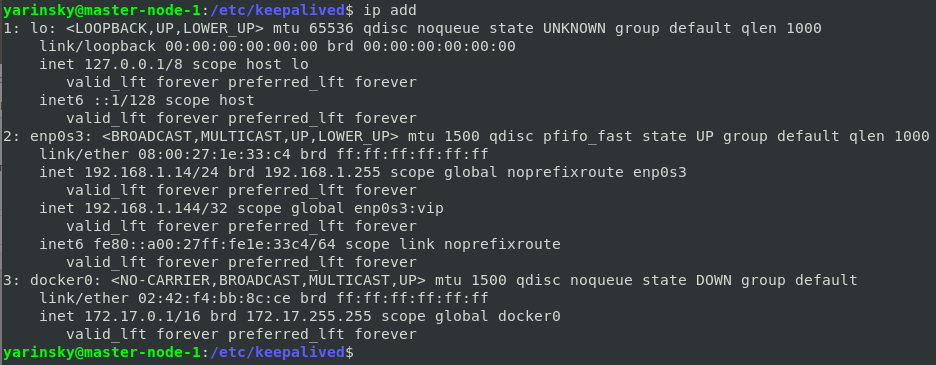
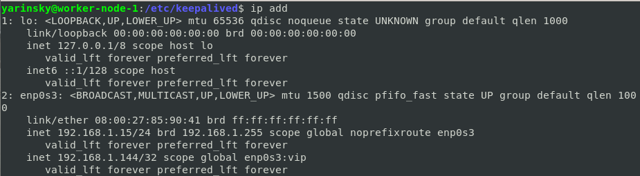

# Домашнее задание к занятию "`10.1. Keepalived/vrrp`" - `Яринский Д.А.`

## Задание 1

Требуется развернуть топологию из лекции и выполнить установку и настройку сервиса Keepalived.

```
vrrp_instance test {
state "name_mode"
interface "name_interface"
virtual_router_id "number id"
priority "number priority"
advert_int "number advert"
authentication {
auth_type "auth type"
auth_pass "password"
}
unicast_peer {
"ip address host"
}
virtual_ipaddress {
"ip address host" dev "interface" label "interface":vip
}
}
```

**Пришлите конфигурацию сервисов для каждой ноды и скриншот вывода команды ip address. Master**

### **Ответ**:

1. =================== Конфигурации master / worker ===================




2. =================== ip add master / worker ===================



---