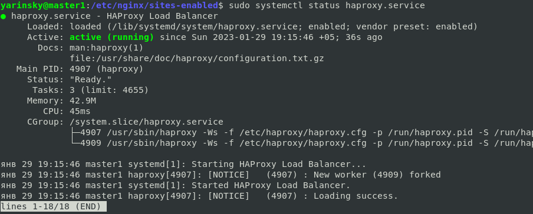
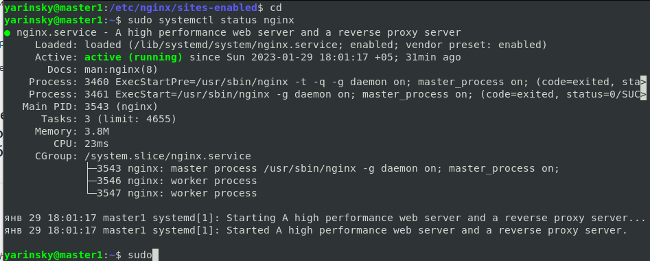
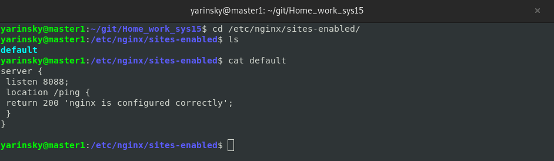
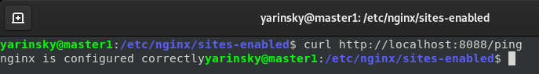
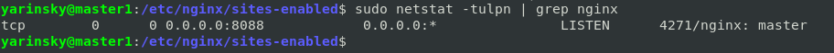

# Домашнее задание к занятию "`10.5 Балансировка нагрузки. HAProxy/Nginx`" - `Яринский Д.А.`

### Задание 1

Что такое балансировка нагрузки и зачем она нужна?

***Приведите ответ в свободной форме.***

### Ответ: 

- Балансировка нагрузки —  метод распределения заданий между несколькими сетевыми устройствами (например, серверами) с целью оптимизации использования ресурсов, сокращения времени обслуживания запросов, горизонтального масштабирования кластера (динамическое добавление/удаление устройств), а также обеспечения отказоустойчивости (резервирования). Т.е. это процесс распределения нагрузки на сервера. Применяется для масштабируемости и отказоустойчивости.

---

### Задание 2

Чем отличаются между собой алгоритмы балансировки round robin и weighted round robin? В каких случаях каждый из них лучше применять?

***Приведите ответ в свободной форме. Отличаются по способу распределения запросов распределяются на сервера.***

###  Ответ: 

- **Round Robin**: Запросы распределяются по пулу сервером последовательно. Если в пуле все сервера одинаковой мощности, 
  то этот алгоритм скорее всего подойдет идеально.

- **Weighted Round Robin:** Имеют дополнительное свойство — вес сервера. С его помощью мы можем указать балансировщику, 
сколько трафика отправлять на тот или иной сервер. Так сервера помощнее будут иметь больший вес, соответственно, 
обрабатывать больше запросов нежели другие сервера.

---

### Задание 3

Установите и запустите haproxy.

***Приведите скриншот systemctl status haproxy, где будет видно, что haproxy запущен.***

### Ответ:
- Install and working debian 11

 
---

### Задание 4

Установите и запустите nginx.

***Приведите скриншот systemctl status nginx, где будет видно, что nginx запущен.***

###  Ответ: 

- nginx status

---

### Задание 5

Настройте nginx на виртуальной машине таким образом, чтобы при запросе:
- `curl http://localhost:8088/ping`

он возвращал в ответе строчку:

- `"nginx is configured correctly"`

***Приведите скриншот получившейся конфигурации.***

### Ответ:

- Nginx config
  

- Nginx status

- Nginx ping

- Nginx port's

---
