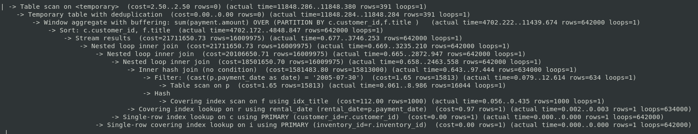
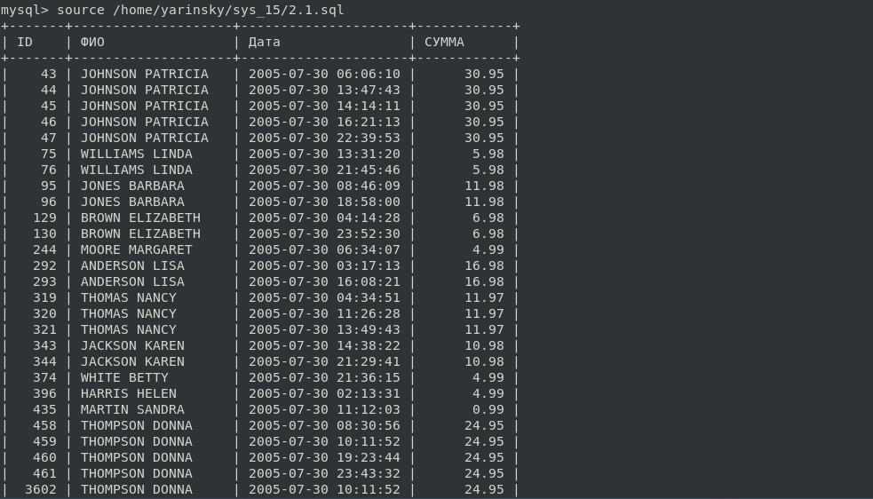
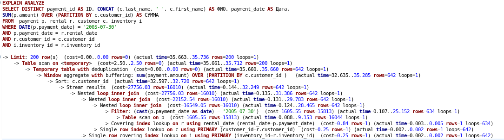
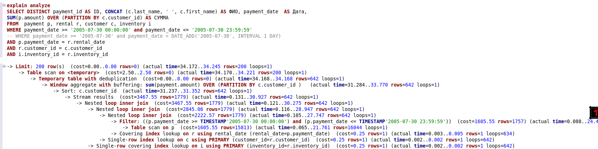
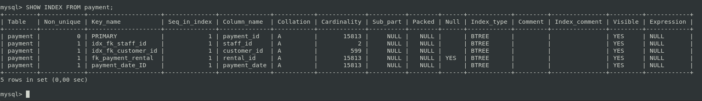
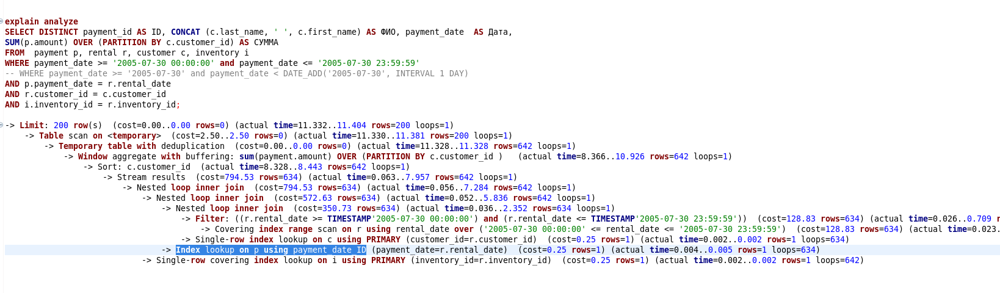

# Домашнее задание к занятию 12.5 "`Индексы`" - `Яринский Д.А.`

Для удобства разместил тут таблицу с файлами:

| № Задания   | Ссылка на файл               | 
|:-----------:|:----------------------------:|
| 1           | [Script_1](script/1.sql)     |
| 2           | [Script_2](script/2.sql)     |
| 2.1         | [Script_2.1](script/2.1.sql) |
|-- Правка -- | -----------------------------|
| 2_1         | [Script_2_1](script/2_1.sql) |
| Лог текст   |   [Log](script/log.txt)      |


## Задание 1

Напишите запрос к учебной базе данных, который вернёт процентное отношение общего размера всех индексов к общему размеру всех таблиц.

## Ответ: 


- Сcылка на скрипт: [Script_1](script/1.sql)
  
- Вывод


---

## Задание 2

Выполните explain analyze следующего запроса:

```
select distinct concat(c.last_name, ' ', c.first_name), sum(p.amount) over (partition by c.customer_id, f.title)
from payment p, rental r, customer c, inventory i, film f
where date(p.payment_date) = '2005-07-30' and p.payment_date = r.rental_date and r.customer_id = c.customer_id and i.inventory_id = r.inventory_id
```
- перечислите узкие места;
- оптимизируйте запрос: внесите корректировки по использованию операторов, при необходимости добавьте индексы.

## Ответ: 

### 2.1  выполним explain analyze

Привёл к более для себя красивому виду, запустил увидел что заняло это от 7 до 11 сек.

Далее понял, что в консоли это смотрится просто ужасно. Было решено сделать в GUI, но файл таки приложу

- Сcылка на скрипт: [Script_2](script/2.sql)




### 2.2. Анализ и рассуждения

Методом `профессионального случайного расчёта` при применении запатентованного инструмента `Ткнуть палкой` - я пришёл к выводу, что необходимо следующее:

- Убрать `f.title` и `film f`
- Можно добавить индекс `payment p`

Привёл все к более читаемому виду. Вроде как всё стало быстрее:


- Сcылка на скрипт: [Script_2.1](script/2.1.sql)





### 2.2.1 (ПРАВКА)

- Сcылка на скрипт: [Script_2_1](script/2_1.sql)
- Ссылка на лог вывода в тексте: [Log](script/log.txt)

Вывод




### 2.3. Добавил index - вроде время сократилось в 2 раза 

index

 

Изменение во времени и рабочий индекс

 

Ссылка на лог вывода в тексте: [Log2](script/log2.txt)

---

