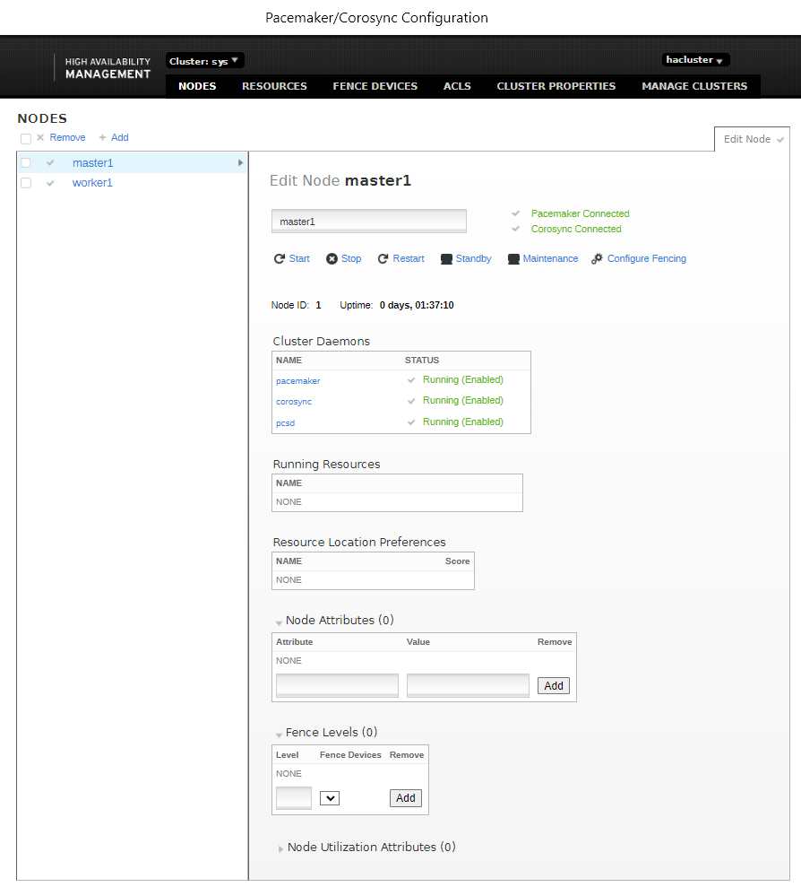
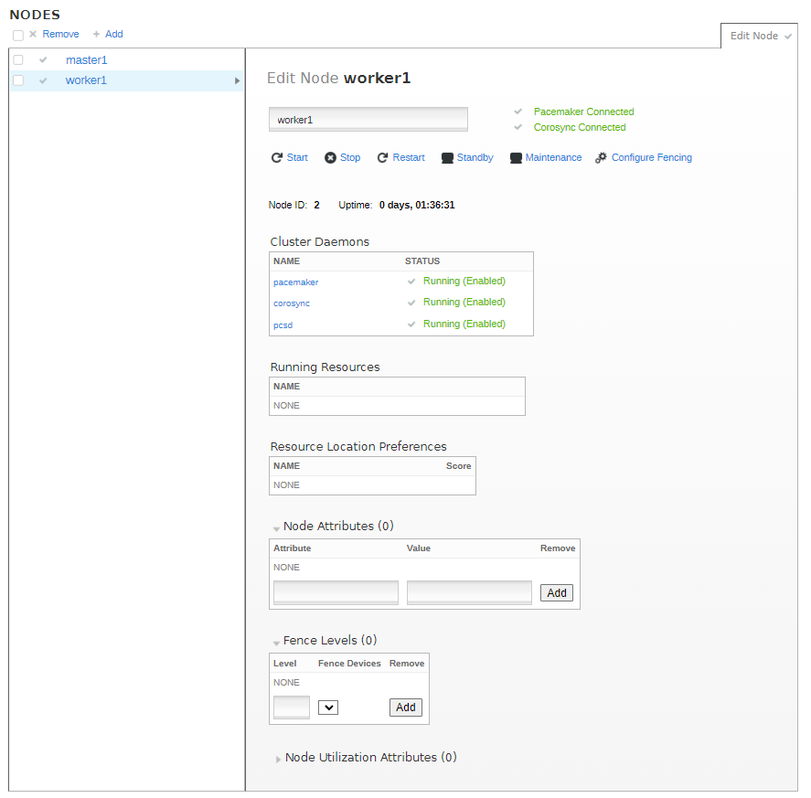
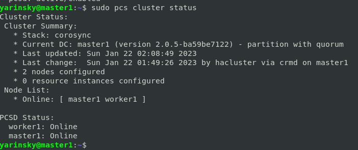
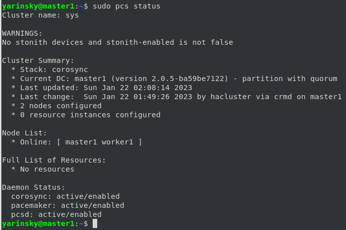
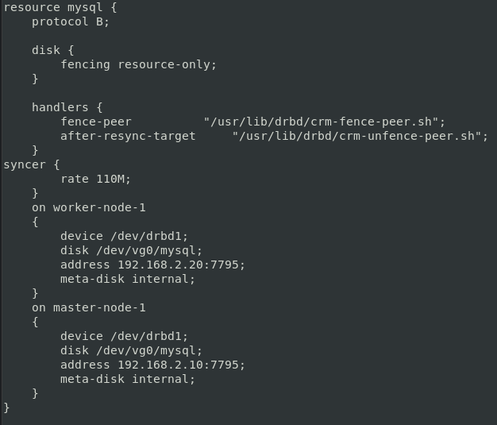
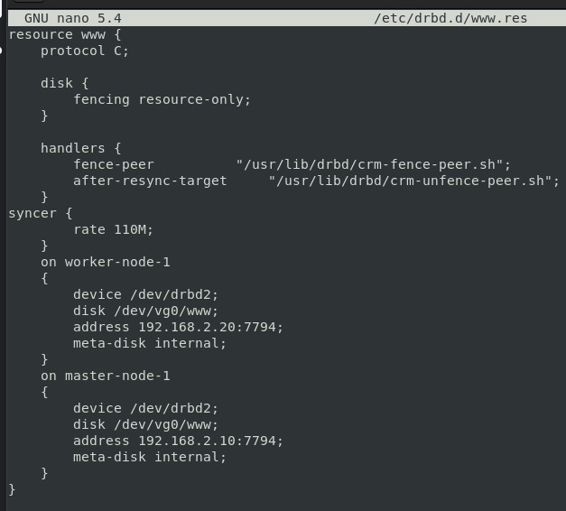
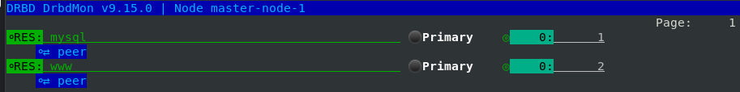
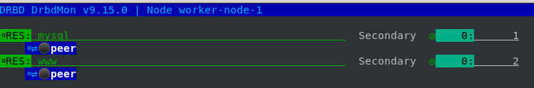

# Домашнее задание к занятию `10.3 «Pacemaker»` - `Яринский Д.А.`

## Задание 1

Опишите основные функции и назначение Pacemaker.

**Приведите ответ в свободной форме.**

## Ответ:

Pacemaker - менеджер ресурсов кластера(Cluster Resource Manager). Его главная задача - достижение максимальной доступности управляемых им ресурсов и защита их от сбоев как на уровне самих ресурсов, 
так и на уровне целых узлов кластера. Архитектура pacemaker состоит из трех уровней:

 - `Кластеронезависимый уровень` - на этом уровне располагаются сами ресурсы и их скрипты, которыми они
управляются и локальный демон, который скрывает от других уровней различия в стандартах, использованных 
в скриптах (на рисунке зеленый).
 - `Менеджер ресурсов` - предстовляет из себя «мозг». Он регирует на события происходящие в кластере: 
отказ или присоединение узлов, ресурсов, переход узлов в сервисный режим и другие административные
действия. 
Pacemaker исходя из сложившейся ситуации делает рассчет наиболее оптимального состояния кластера и дает
команды на выполнения действий для достижения этого состояния(остановка/перенос ресурсов или узлов). 
На рисунке обозначен синим.
 - `Информационный уровень` - на этом уровне осуществляется сетевое взаимодействие узлов, т.е. передача
сервисных команд(запуск/остановка ресурсов, узлов и т.д.), обмен информацией о полноте состава кластера(quorum)и т.д. На рисунке обозначен красным. Как правило на этом уровне работает Corosync/OpenAIS.

**Основные функции:**

 - Позволяет находить и устранять сбои на уровне нод и служб; 
 - Не зависит от подсистемы хранения; 
 - Не зависит от типов ресурсов: все, что можно прописать в скрипты, можно кластеризовать;
 - Поддерживает STONITH (Shoot-The-Other-Node-In-The-Head), т.е. умершая нода изолируется и запросы к ней
   не поступают, пока нода не отправит сообщение о том, что она снова в рабочем состоянии; 
 - Поддерживает кворумные и ресурсозависимые кластеры любого размера; 
 - Поддерживает практически любую избыточную конфигурацию; 
 - Может автоматически реплицировать конфиг на все узлы кластера — не придется править все вручную; 
 - Поддерживает расширенные типы ресурсов: клоны и дополнительные состояния master/slave и подобное.

## Задание 2

Опишите основные функции и назначение Corosync.

**Приведите ответ в свободной форме.**

## Ответ:

`Corosync` - программный продукт, позволяющий реализовать кластер серверов. Его основное назначение — знать
и передавать состояние всех участников кластера.

В основе работы заложены следующие функции:

- Отслеживание состояния приложений;
- Оповещение приложений о смене активной ноды кластера;
- Отправка одинаковых сообщений процессам на всех узлах кластера;
- Предоставление доступа к базе данных с конфигурацией и статистикой, а также отправка уведомлений о 
ее изменениях.

---

## Задание 3

Соберите модель, состоящую из двух виртуальных машин. Установите Pacemaker, Corosync, Pcs. Настройте HA кластер.

**Пришлите скриншот рабочей конфигурации и состояния сервиса для каждого нода.**

## Ответ:

- master1

- master2

- status

- status full

---
## Дополнительные задания (со звездочкой*)

## Задание 4

Установите и настройте DRBD-сервис для настроенного кластера.

**Пришлите скриншот рабочей конфигурации и состояние сервиса для каждого нода.**

## Ответ:

- mysql conf

- www conf

- status master
  

- status worker

- moon master / worker 

