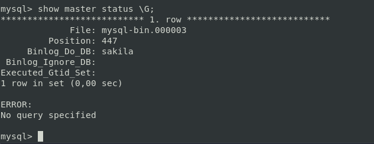
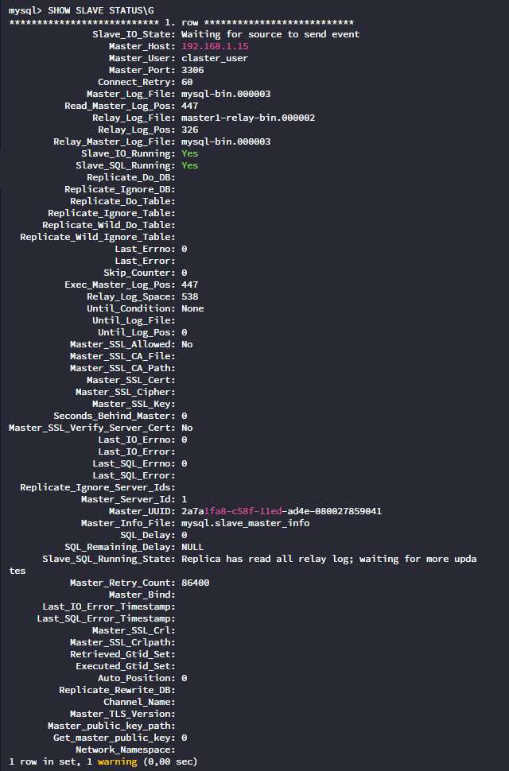
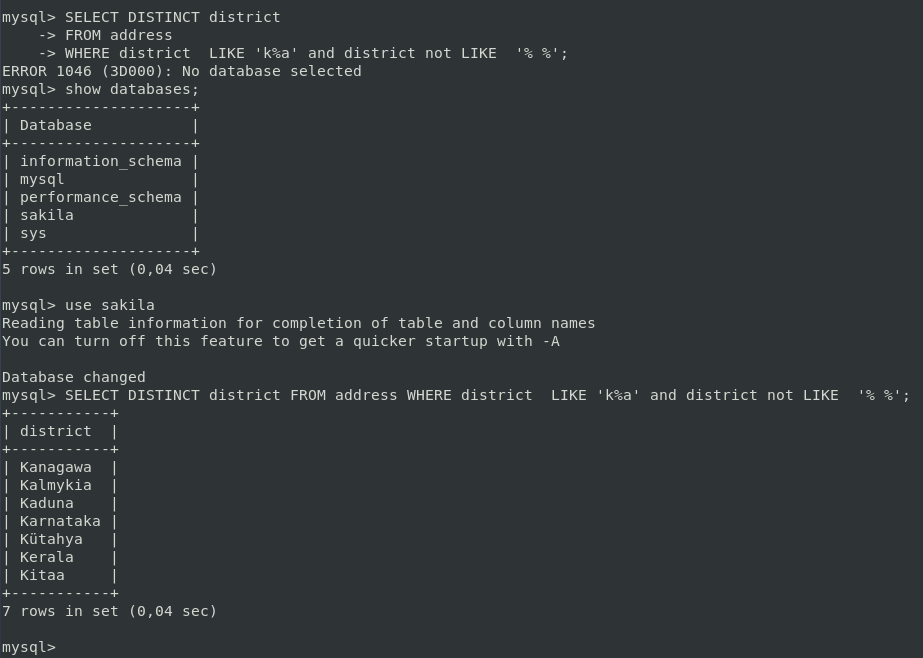

# Домашнее задание к занятию 12.6 "`Репликация и масштабирование. Часть 1`" - `Яринский Д.А.`

## Задание 1

На лекции рассматривались режимы репликации master-slave, master-master, опишите их различия.

***Ответить в свободной форме.***

## ОТВЕТ:

Рассматривались два режима их основные функции и различия:

**master-slave**: 
- Изменения возможны только на master;
- Данные на slave доступны только на чтение;
- Slave потребляет больше ресурсов чем master.
- Отсутствие автоматического переключения на другой ресурс (в режим мастер).

**Master-Master**:

- Каждый сервер является и master и slave.
- Приложения могут считывать данные с обоих основных устройств;
- Распределяет нагрузку на запись между обоими главными узлами;
- Автоматический и быстрый переход на другой ресурс;
- Слабо согласовано.
- Любые изменения на одном из серверов применятся на другом.

---

## Задание 2

Выполните конфигурацию master-slave репликации, примером можно пользоваться из лекции.

***Приложите скриншоты конфигурации, выполнения работы: состояния и режимы работы серверов.***

## ОТВЕТ:

Т.к. с прошлых заданий у нас уже есть база, будет хорошей практикой развернуть еще одну машину, создать там пустую базу и
сделать `master-slave`

**Вводные:**

Master BD: 192.168.1.15 worker1
Stalve BD: 192.168.1.14 master

**Настроим мастер**:

- sudo nano /etc/mysql/my.cnf

```
[mysqld]
pid-file        = /var/run/mysqld/mysqld.pid
socket          = /var/run/mysqld/mysqld.sock
datadir         = /var/lib/mysql
log-error       = /var/lib/mysql/error.log
bind-address    = 192.168.1.15
server-id       = 1
log_bin         = /var/log/mysql/mysql-bin.log
max_binlog_size = 500M
slow_query_log  = 1
#read_only      = 1
binlog_do_db = sakila
```

- sudo systemctl restart mysql.service

**Создадим пользователя claster_user на мастере:**

- CREATE USER 'claster_user'@'%' IDENTIFIED BY '12345678';
- GRANT REPLICATION SLAVE ON *.* TO 'claster_user'@'%';
- ALTER USER 'claster_user' IDENTIFIED WITH mysql_native_password BY '12345678';
- FLUSH PRIVILEGES;

**Блокируем все таблицы в БД**

- use sakila 
- FLUSH TABLES WITH READ LOCK;

**Проверяем статус Master-сервера:**

- SHOW MASTER STATUS;


**Создаем дамп базы данных:**

mysqldump -u root -p sakila > sakila.sql

**Разблокируем таблицы в консоли mysql:**

- UNLOCK TABLES;

**Переносим дамп базы на Slave-сервер**

- scp sakila.sql yarinsky@192.168.1.14:/home/yarinsky

**Настройка Slave**

Созданием базу данных

- mysql -u root -p
- CREATE DATABASE sakila;

**Загружаем дамп:**

- mysql -u root -p sakila < sakila.sql

**Вносим изменения в my.cnf**

- sudo nano  /etc/mysql/my.cnf
- sudo systemctl restart mysql.service

**Задаем подключение к Master серверу**

- mysql -u root -p
  
```
CHANGE MASTER TO MASTER_HOST='192.168.1.15', MASTER_USER='claster_user', MASTER_PASSWORD='12345678', MASTER_LOG_FILE = 'mysql-bin.000001', MASTER_LOG_POS = 327;
```

**Запускаем репликацию на подчиненном сервере:**

```
 CHANGE MASTER TO MASTER_HOST='192.168.1.15',MASTER_USER='claster_user', MASTER_PASSWORD='12345678', MASTER_LOG_FILE='mysql-bin.000003', MASTER_LOG_POS= 447;
```
 - START SLAVE;

**Проверяем всё:**

- show master status \G;
- show slave status \G;
- SELECT DISTINCT district FROM address WHERE district  LIKE 'k%a' and district not LIKE  '% %';

мастер



слейв



Производим запрос на слейве



---
