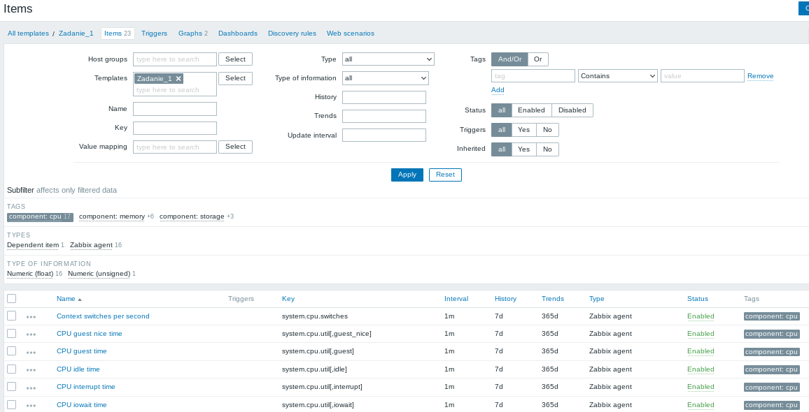
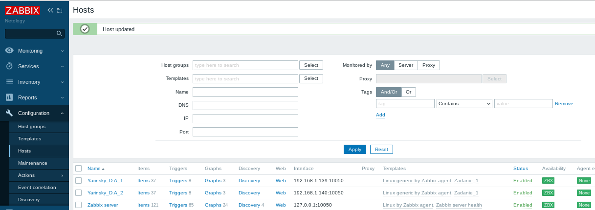
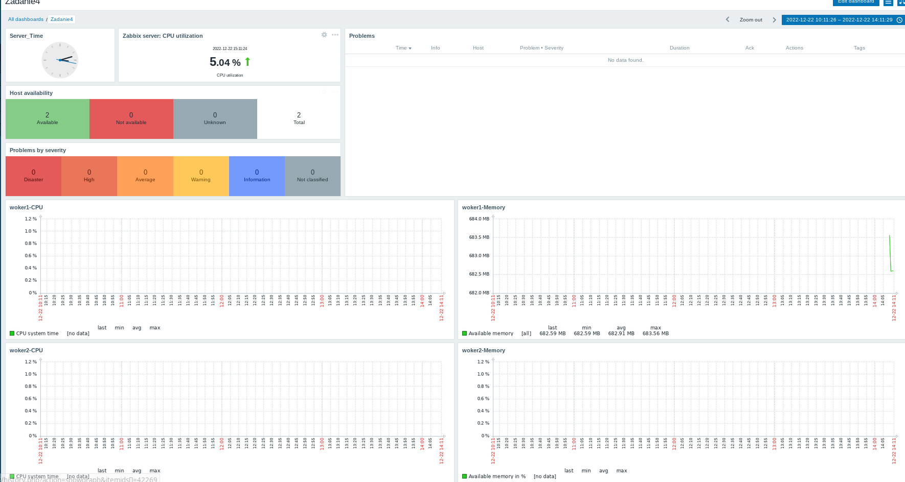

# Домашнее задание к занятию "9.3. Система мониторинга Zabbix. Часть 2" - "Яринский Д.А."

## Задание 1

- Создайте свой шаблон, в котором будут элементы данных, мониторящие загрузку CPU и RAM хоста.
- Сохраните в Git скриншот страницы шаблона с названием “Задание 1”

### Ответ:
Можно было сделать template в вложенными template СPU и Memory, 
но я решил всё же сделать все в одном.
* Screenhot CPU parametr parameter

* Screenhot Memory parametr parameter

---
## Задание 2

Добавьте в Zabbix два хоста и задайте им имена <фамилия и инициалы-1> и <фамилия и инициалы-2>. 
**Пример:** `ivanovii-1 и ivanovii-2`

***Результат данного задания сдавайте вместе с Заданием 3***

---
## Задание 3

Привяжите созданный вами шаблон к двум хостам. Так же привяжите к обоим хостам шаблон Linux by Zabbix Agent.

***Сохраните в Git скриншот страницы хостов где будут видны привязки шаблонов с названием “Задание 2-3”. Хосты должны иметь зелёный статус подключения***

### Ответ 2 - 3 :

* Screenhot all hosts and all template

---
## Задание 4

Создайте свой кастомный дашборд

***Сохраните в Git скриншот дашборда с названием “Задание 4”***

### Ответ:
* Screenhot Custom Dashboard

