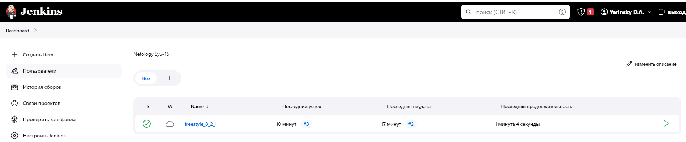
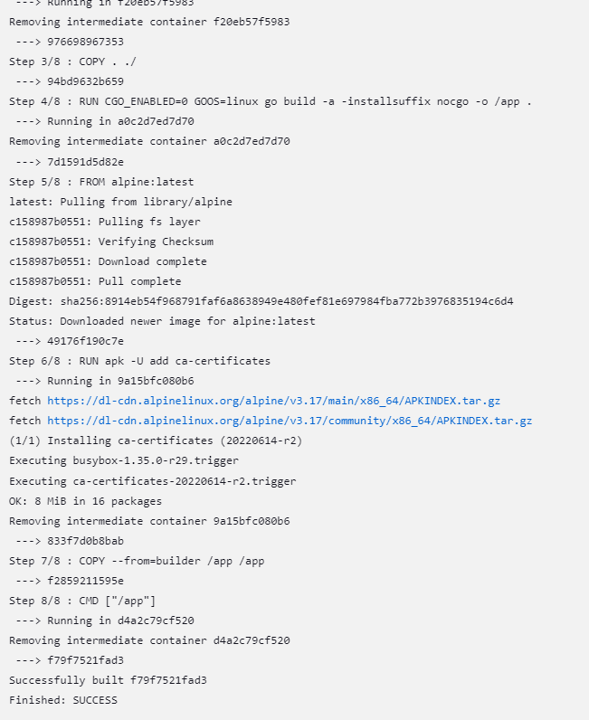
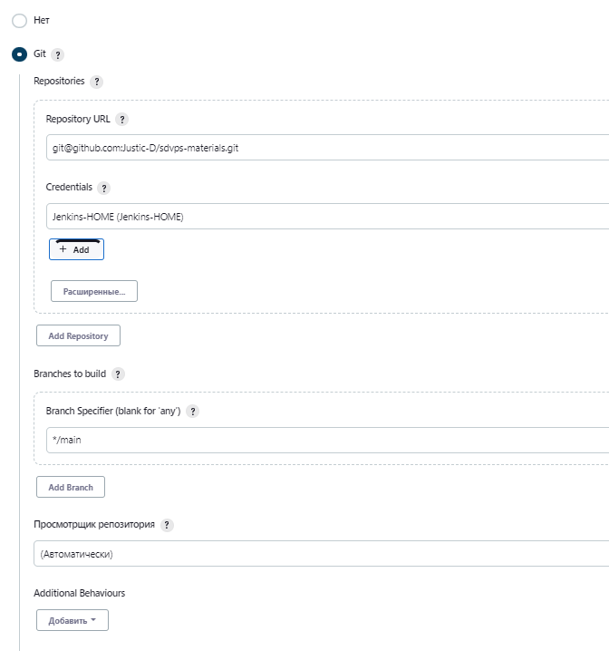
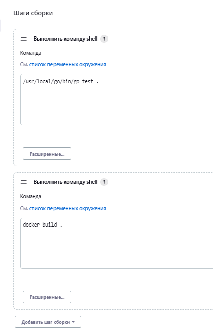
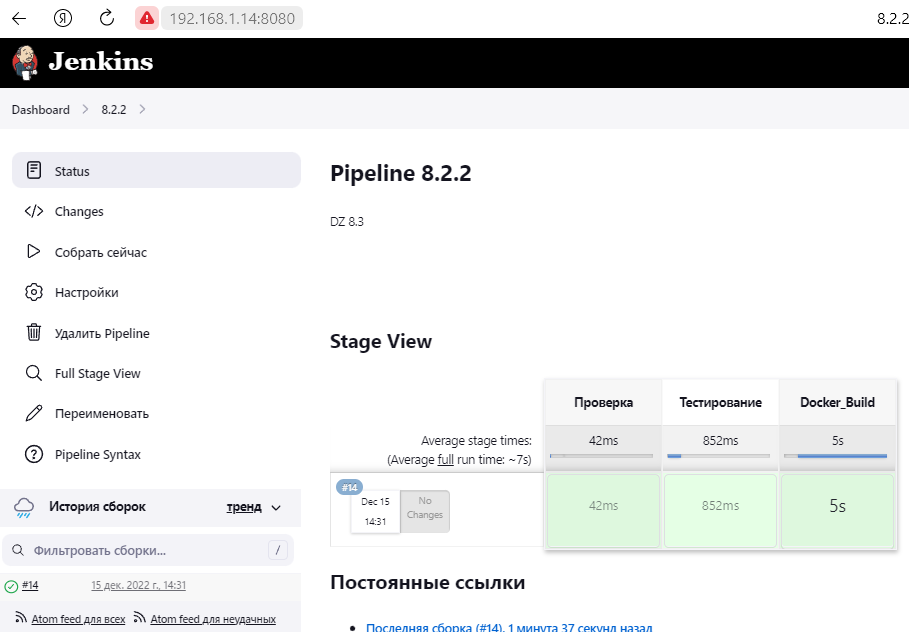
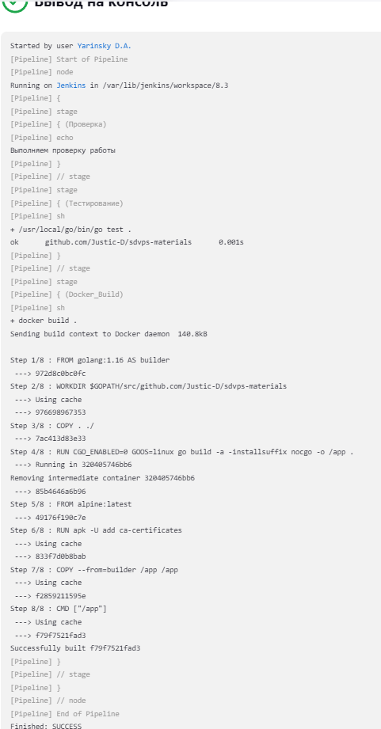
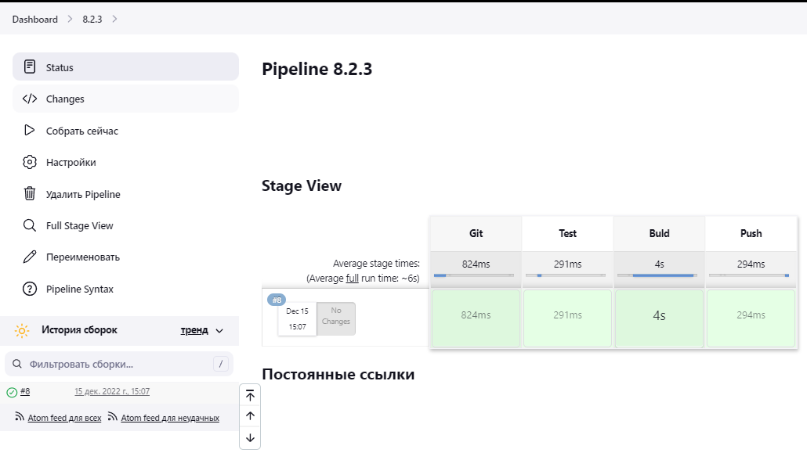
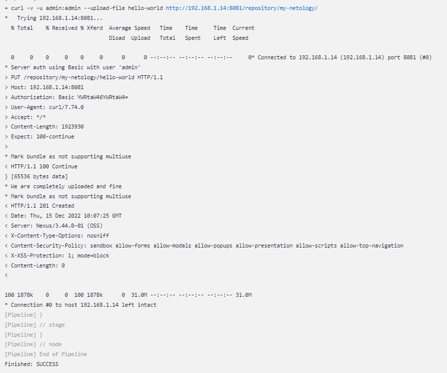
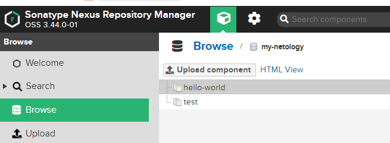

# Домашнее задание к занятию "`8.2 `" - `Яринский Д.А.`
---

### Задание 1

1. Установите себе jenkins, следуя инструкции из лекции (или любым другим способом из официальной документации). Использовать docker в данном задании нежелательно.
2. Установите на машину с jenkins golang.
3. Используя свой аккаунт на GitHub, сделайте себе форк репозитория. В этом же репозитории находится дополнительный материал для выполнения ДЗ.
4. Создайте в дженкинсе freestyle проект, подключите получившийся репозиторий к нему и произведите запуск тестов и сборку проекта go test . и docker build .

*В качестве ответа пришлите скриншоты с настройками проекта и результатами выполнения сборки*

### Ответ:

**Скриншот-1**



**Скриншот-2**



**Скриншот-3**



**Скриншот-4**



---

### Задание 2

1. Создайте новый проект pipeline.
2. Перепишите сборку из задания 1 на declarative(в виде кода).

*В качестве ответа пришлите скриншоты с настройками проекта и результатами выполнения сборки.*

### Ответ:

========= **Code** ==========
```
pipeline {
    agent any
    
    stages {
      stage('Проверка') {
        steps {
          echo 'Выполняем проверку работы'
        }
      }
      stage('Тестирование') {
        steps {
          sh '/usr/local/go/bin/go test .'
        }
      }
      stage('Docker_Build') {
        steps {
          sh 'docker build .'
        }
      }
    }
}
```
**Скриншот 1**



**Скриншот 2**



---

### Задание 3

1. Установите на машину Nexus.
2. Создайте raw-hosted репозиторий.
3. Измените пайплайн таким образом, чтобы вместо docker-образа собирался 
бинарный go-файл (команду можно скопировать из Dockerfile).
4. Загрузите файл в репозиторий с помощью jenkins
5. В качестве ответа пришлите скриншоты с настройками проекта и результатами выполнения сборки

### Ответ:

=========**Code**=========
```
pipeline {
  agent any

  stages {
    stage('Git') {
      steps {
        git branch: 'main', url: 'https://github.com/Justic-D/sdvps-materials.git'
      }
    }
    stage('Test') {
      steps {
        sh '/usr/local/go/bin/go test .'
      }
    }
    stage('Buld') {
      steps {
        sh '/usr/local/go/bin/go build -a -installsuffix nocgo -o ./hello-world .'
      }
    }
    stage('Push') {
      steps {
        sh 'curl -v -u admin:admin --upload-file hello-world  http://192.168.1.14:8081/repository/my-netology/'
      }
    }
  }
}
```
**Скриншот 1**



**Скриншот 2**



**Скриншот 3**


