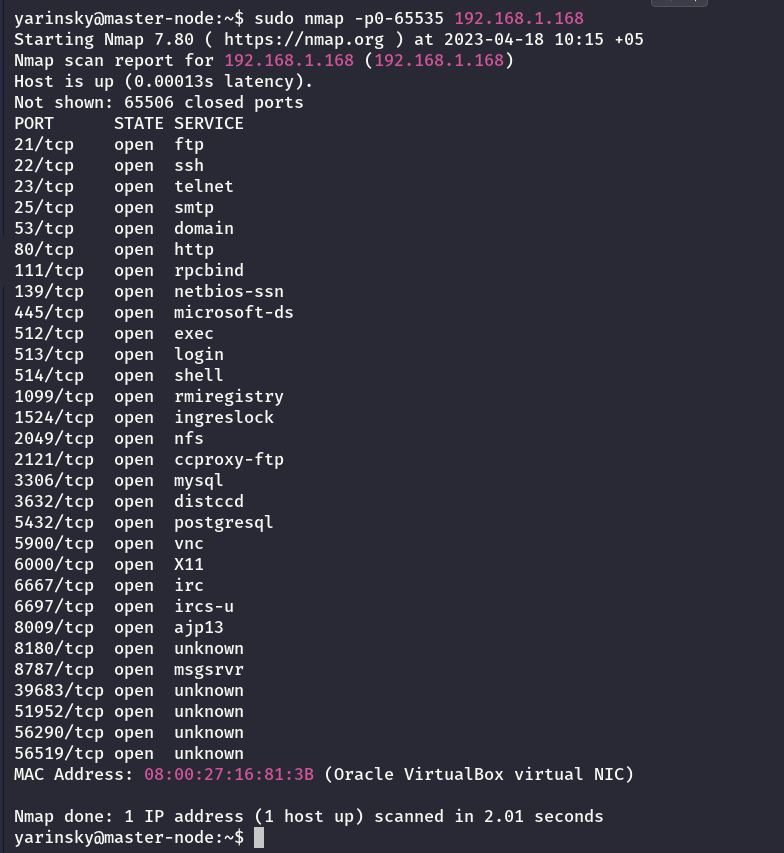
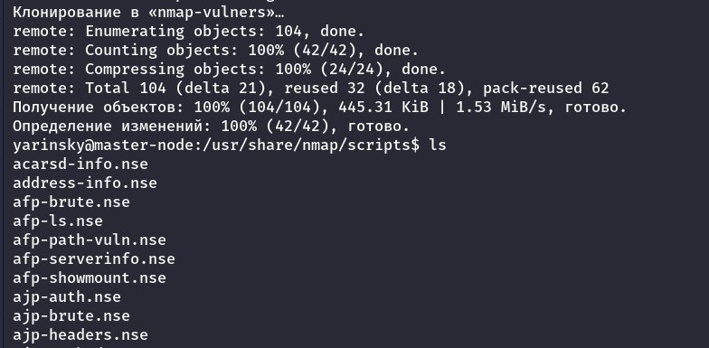

# Домашнее задание к занятию 11.3 "`ELK`" - `Яринский Д.А.`

## Задание 1 - Elasticsearch

Установите и запустите Elasticsearch, после чего поменяйте параметр cluster_name на случайный.

***Приведите скриншот команды 'curl -X GET 'localhost:9200/_cluster/health?pretty', сделанной на сервере с установленным Elasticsearch. Где будет виден нестандартный cluster_name.***

## Ответ:

Я пробовал разные варианты усановки вообщем работает по `htpp`, `htpps` только так: 

## Задание 2. Kibana
Установите и запустите Kibana.

***Приведите скриншот интерфейса Kibana на странице http://<ip вашего сервера>:5601/app/dev_tools#/console, где будет выполнен запрос GET /_cluster/health?pretty.***

## Ответ:

## Задание 3. Logstash
Установите и запустите Logstash и Nginx. С помощью Logstash отправьте access-лог Nginx в Elasticsearch.

**Приведите скриншот интерфейса Kibana, на котором видны логи Nginx.**

## Задание 4. Filebeat.

Установить и запустить Filebeat. Переключить поставку логов Nginx с Logstash на Filebeat.

***Приведите скриншот интерфейса kibana, на котором видны логи nginx, которые были отправлены через Filebeat.***

## Ответ:

---