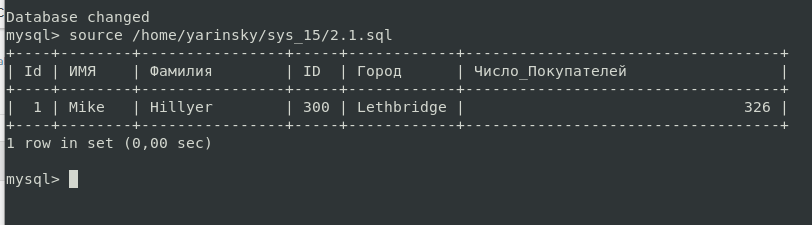

# Домашнее задание к занятию 12.4."SQL. Часть 2" - `Яринский Д.А.`

## Таблица со всеми файлами `sql` запросов для удобства

| № Задания   | Ссылка на файл              | 
|:-----------:|:---------------------------:|
| 1           | [Script_1](script/1.sql)    |
| 2           | [Script_2](script/2.sql)    |
| 3           | [Script_3](script/3.sql)    |
| 3.1         | [Script_3.1](script/3.1.sql)|

## Задание 1 (обновленная правка)

Одним запросом получите информацию о магазине, в котором обслуживается более 300 покупателей, и выведите в результат следующую информацию:

- фамилия и имя сотрудника из этого магазина;
- город нахождения магазина;
- количество пользователей, закреплённых в этом магазине.

## Ответ:

- Сcылка на обновленный скрипт: [Script_1](script/1.sql)

---

## Задание 2

Получите количество фильмов, продолжительность которых больше средней продолжительности всех фильмов.

## Ответ:

- Сcылка на скрипт: [Script_2](script/2.sql)

---

## Задание 3 (Правка)

Получите информацию, за какой месяц была получена наибольшая сумма платежей, и добавьте информацию по количеству аренд за этот месяц.

## Ответ:

### 3.1 Правка

- Сылка на правку: [Script_3.1](script/3.1.sql)

---