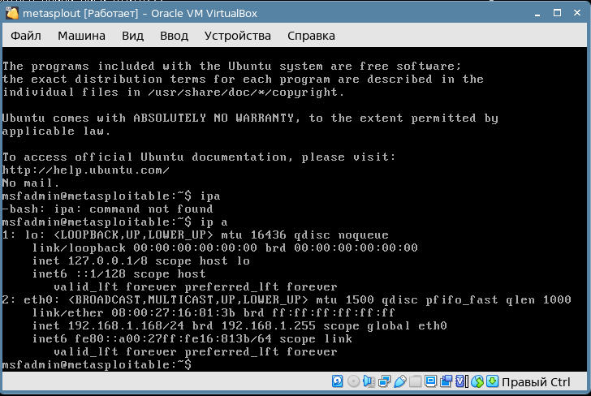
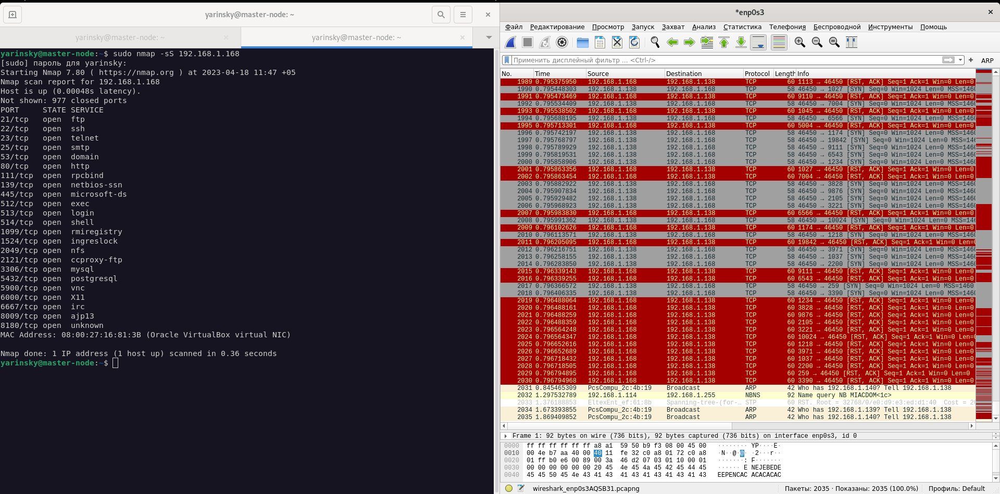

# Домашнее задание к занятию 13.1 "`Уязвимости и атаки на информационные системы`" - `Яринский Денис`

## Задание 1

Скачайте и установите виртуальную машину Metasploitable: https://sourceforge.net/projects/metasploitable/.

Это типовая ОС для экспериментов в области информационной безопасности, с которой следует начать при анализе уязвимостей.

- Просканируйте эту виртуальную машину, используя nmap.
- Попробуйте найти уязвимости, которым подвержена эта виртуальная машина.

Сами уязвимости можно поискать на сайте https://www.exploit-db.com/.

Для этого нужно в поиске ввести название сетевой службы, обнаруженной на атакуемой машине, и выбрать подходящие по версии уязвимости.

Ответьте на следующие вопросы:
 - Какие сетевые службы в ней разрешены?
 - Какие уязвимости были вами обнаружены? (список со ссылками: достаточно трёх уязвимостей)

***Приведите ответ в свободной форме.***

## Ответ: 

Установил виртуалку и узнал ip:

Определил открытые порты:

Сделал из nmap сканер уязвимости т.е. установил  Nmap-vulscan:

Провёл скан уязвимостей коммандой `nmap -A --script vulners.nse 192.168.1.168`
Тут много уязвимостей вкл базы данных:

---

## Задание 2

Проведите сканирование Metasploitable в режимах SYN, FIN, Xmas, UDP.

Запишите сеансы сканирования в Wireshark.

Ответьте на следующие вопросы:

- Чем отличаются эти режимы сканирования с точки зрения сетевого трафика?
- Как отвечает сервер?

***Приведите ответ в свободной форме.***

## Ответ: 

Установил wireshark - думаю тут нет смысла делать скриншоты, гуглится на первой странице. Есть в репах Debian 11.

Далее провёл сканирование в разных режимах:

- SYN-сканирование где можно увидеть что пакет с флагами SYN/ACK-порт открыт RST-закрыт, что мы и видим в wireshark

- FIN-сканирование

Удаленному хосту посылаются пакеты с флагом FIN, которые применяются при закрытии соединения. 
В этом случае закрытый порт компьютера, должен послать ответный пакет с флагом RST.
Если порт открыт или блокируется брандмауэром, ответа от него не будет. 
   
Как и в случае SYN-сканирования, соединение устанавливается не полностью но большинство систем 
мониторинга могут зафиксировать этот тип сканирования. 

Данный метод является более скрытным по сравнению с TCP сканированием и позволяет определить, закрыт порт или открыт (блокируется), 

Есть несколько модификаций метода.

- Xmas-сканирование:

Метод схожий c FIN. Хосту отсылается пакет, раскрашенный несколькими флагами (FIN, PSH и URG).

- UDP сканирование -возможны три сценария:
 - - Ответ не получен, тогда nmap помечает порт как open filtered. 
 - - Он может получить ответ UDP, но это бывает очень редко. В таком случае порт помечается как open. 
 - - Если порт closed и он получает обратный echo-запрос ICMP, это означает, что порт недоступен.

---

