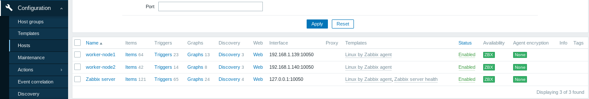

# Домашнее задание к занятию "`9.2. Zabbix. Часть 1`" - `Яринский Д.А.`

## Задание 1

- `Установите Zabbix Server с веб-интерфейсом.`

***`Приложите скриншот авторизации в админке. Приложите текст использованных команд в GitHub.`***

### **Ответ**:

**`1. Code Install and work Zabix Server / client`**

* **1.1 Install Zabbix repository**

```
wget https://repo.zabbix.com/zabbix/6.0/debian/pool/main/z/zabbix-release/zabbix-release_6.0-4%2Bdebian11_all.deb
sudo dpkg -i zabbix-release_6.0-4+debian11_all.deb
sudo apt-get update
```

* **1.2 Install Zabbix server, frontend, agent, PostreSQL**

```
sudo apt install zabbix-server-pgsql zabbix-frontend-php php7.4-pgsql zabbix-apache-conf zabbix-sql-scripts zabbix-agent
sudo apt Install postgresql
```

* **1.3 Create initial database**

```
sudo -u postgres createuser --pwprompt zabbix # password 12345678
sudo -u postgres createdb -O zabbix zabbix
```

* **1.4 Zabbix server host import initial schema and data. And newly created password.**

```
zcat /usr/share/zabbix-sql-scripts/postgresql/server.sql.gz | sudo -u zabbix psql zabbix
```

* **1.5 Configure the database for Zabbix server**

*Edit file /etc/zabbix/zabbix_server.conf*

* **1.6 Start Zabbix server and agent processes**

```
sudo nano /etc/zabbix/zabbix_server.conf
- DBPassword=12345678
```
  
*Start Zabbix server and agent processes and make it start at system boot.*

```
sudo systemctl restart zabbix-server zabbix-agent apache2
sudo systemctl enable zabbix-server zabbix-agent apache2
```

* **1.7 Join Master work zabbix_server**

```
http://192.168.1.138/zabbix/setup.php
```

`2. ScreenShots`


---

## Задание 2

- **`Установите Zabbix Agent на два хоста.`**

***Приложите скриншот раздела Configuration > Hosts, где видно, что агенты подключены к серверу. Приложите скриншот лога zabbix agent, где видно, что он работает с сервером. Приложите скриншот раздела Monitoring > Latest data для обоих хостов, где видны поступающие от агентов данные. Приложите текст использованных команд в GitHub.***

### **Ответ**:

**`1. Code Install Zabix Agent v2`**

* **1.1 Install Repo**

```
wget https://repo.zabbix.com/zabbix/6.0/debian/pool/main/z/zabbix-release/zabbix-release_6.0-4%2Bdebian11_all.deb
sudo dpkg -i zabbix-release_6.0-4+debian11_all.deb
sudo apt update
```

* **1.2 Install Agent v2 and start**

```
sudo apt install zabbix-agent2 zabbix-agent2-plugin-*
sudo systemctl restart zabbix-agent2
sudo systemctl enable zabbix-agent2
```

* **1.3 Configure Agent worker node**

```
cd /etc/zabbix
sudo nano zabbix_agent2.conf
```

***Search:*** 
* ***`Server=`***

***Add IP Adress***:
* **`192.168.1.138`** ___ and restart sevice***

```
sudo systemctl restart zabbix-agent2
```

**`2. ScreenShots`**

* **2.1 Configuration > Hosts**



* **2.2 Availability report workres node**


* **2.3 Monitoring > Latest data - workers node**


---

* **2.4 Finall Dashboard and tail conf files worker node**


