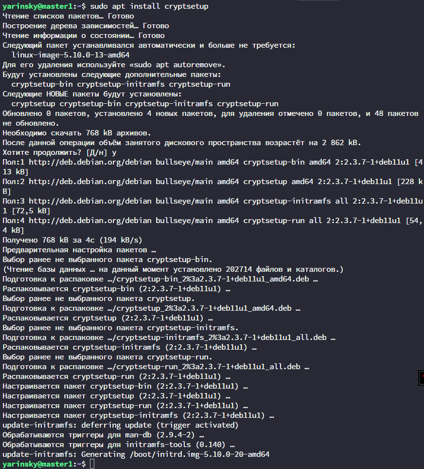
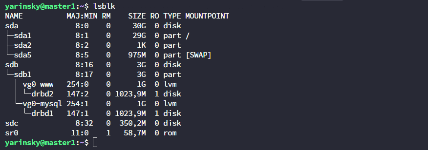
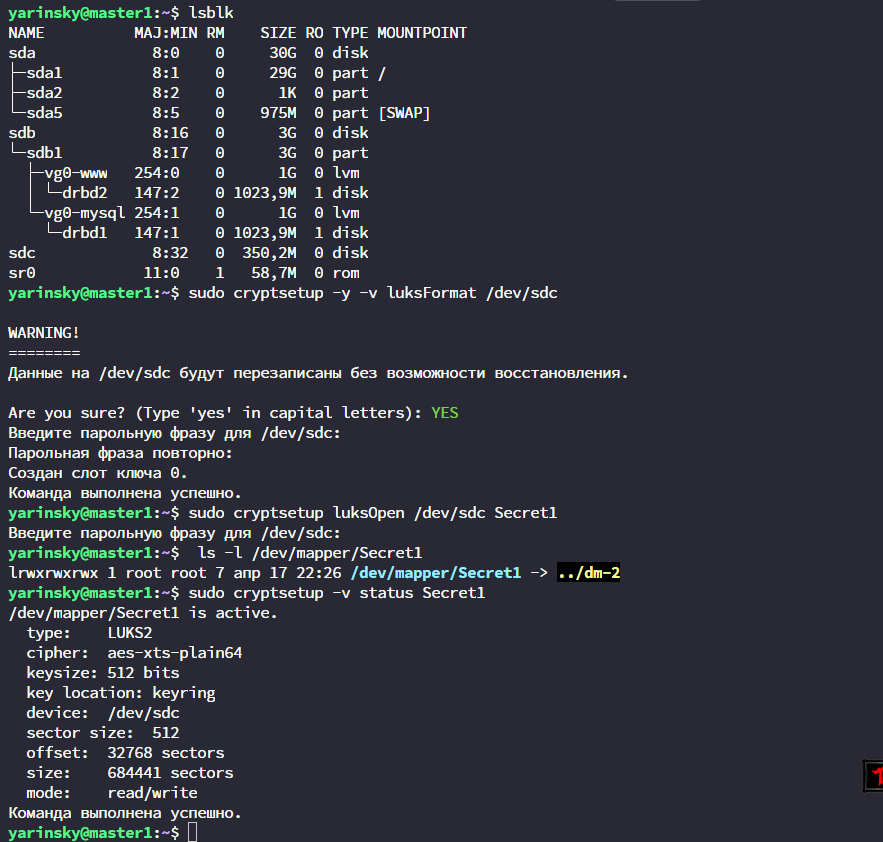

# Домашнее задание к занятию "`13.2 Защита хоста`" - `Яринский Денис`

## Задание 1

- Установите eCryptfs.
- Добавьте пользователя cryptouser.
- Зашифруйте домашний каталог пользователя с помощью eCryptfs.

***В качестве ответа пришлите снимки экрана домашнего каталога пользователя с исходными и зашифрованными данными.***

## Ответ: 

Установим eCryptf:

Создадим пользователя:

Произведём шифрацию:

Проверим монтирование:

Произведем проверку (залил файлы от ansible)

---

## Задание 2

- Установите поддержку LUKS.
- Создайте небольшой раздел, например, 100 Мб.
- Зашифруйте созданный раздел с помощью LUKS.

***В качестве ответа пришлите снимки экрана с поэтапным выполнением задания.***

## Ответ:

Установим luks:

Проверим и создадим раздел:

Отформотируем, примонтируем и проверим работу:

