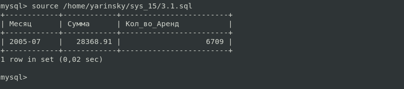

# Домашнее задание к занятию 12.2 "`Работа с данными (DDL/DML)`" - `Яринский Д.А.`

Задание можно выполнить как в любом IDE, так и в командной строке.

## Задание 1

1.1. Поднимите чистый инстанс MySQL версии 8.0+. Можно использовать локальный сервер или контейнер Docker.

1.2. Создайте учётную запись sys_temp.

1.3. Выполните запрос на получение списка пользователей в базе данных. (скриншот)

1.4. Дайте все права для пользователя sys_temp.

1.5. Выполните запрос на получение списка прав для пользователя sys_temp. (скриншот)

1.6. Переподключитесь к базе данных от имени sys_temp.

Для смены типа аутентификации с sha2 используйте запрос:

```
ALTER USER 'sys_test'@'localhost' IDENTIFIED WITH mysql_native_password BY 'password';
```
1.6. По ссылке https://downloads.mysql.com/docs/sakila-db.zip скачайте дамп базы данных.

1.7. Восстановите дамп в базу данных.

1.8. При работе в IDE сформируйте ER-диаграмму получившейся базы данных. При работе в командной строке используйте команду для получения всех таблиц базы данных. (скриншот)

***Результатом работы должны быть скриншоты обозначенных заданий, а также простыня со всеми запросами.***

## ОТВЕТ:

### 1.1 - Поднимите чистый инстанс MySQL версии 8.0+. Можно использовать локальный сервер или контейнер Docker

**1.1.1 Install MySQL**
- cd /tmp
- wget -c https://dev.mysql.com/get/mysql-apt-config_0.8.24-1_all.deb
- ls -fla | grep mysql
- sudo dpkg -i mysql-apt-config_0.8.24-1_all.deb
- sudo cat /etc/apt/source.list.d/mysql.list
- sudo apt update
- sudo apt install mysql-server
- password 12345678
- Strong Password Encryption ----- OK
- mysql_secure_installation
```
VALIDATE PASSWORD COMPONENT — использовать компонент VALIDATE PASSWORD? (No)
Изменить пароль от root? (No)
Удалить анонимных пользователей? (y)
Запретить удалённый логин под root? (y)
Удалить тестовую базу и доступ к ней? (y)
Обновить таблицу привилегий? (y)
```

**1.1.2 Check Working MySQL**
- sudo systemctl status mysql.service
- sudo systemctl is-enabled mysql


### 1.2 Создайте учётную запись sys_temp.

- mysql -u root -p # Входим в учётку
- CREATE USER 'sys_temp'@'%' IDENTIFIED BY '12345678'; Создаём универсального пользователя 


### 1.3 Выполните запрос на получение списка пользователей в базе данных. (скриншот)


### 1.4 Дайте все права для пользователя sys_temp.

```
-  GRANT ALL PRIVILEGES ON  *.* TO 'sys_temp'@'%';
```

### 1.5 Выполните запрос на получение списка прав для пользователя sys_temp. (скриншот)


### 1.6 Переподключитесь к базе данных от имени sys_temp.

Заранее ввёл рекомендуемую комманду для смены типа входа от root:
- ALTER USER 'sys_temp'@'%' IDENTIFIED WITH mysql_native_password BY '12345678';
Далее перезашёл уже под пользователем sys_temp


Скачал Архив и распаковал:
 - cd /tmp
 - wget https://downloads.mysql.com/docs/sakila-db.zip
 - unzip sakila-db.zip
 - cd sakila-db

### 1.7 Восстановите дамп в базу данных.

Для начала были соблюдены необходимые действия для дампа такие как повышение прав дополнительно т.к. не давало создавать базу в целом вот шаги:

- mysql -u root -p
```
- GRANT ALL PRIVILEGES ON *.* TO 'sys_temp'@'%' WITH GRANT OPTION; 

  Вначале были проблемы, потом понял почему и исправил
```
- FLUSH PRIVILEGES;           
- exit
- mysql -u sys_temp -p
- CREATE DATABASE sakila;     
- exit
- mysql -u sys_temp -p < /tmp/sakila-db/sakila-schema.sql
- mysql -u sys_temp -p < /tmp/sakila-db/sakila-data.sql
- mysql -u sys_temp -p
- use sakila;
- show tables;


### 1.8. При работе в IDE сформируйте ER-диаграмму получившейся базы данных. При работе в командной строке используйте команду для получения всех таблиц базы данных. (скриншот)


---
## Задание 2 

Составьте таблицу, используя любой текстовый редактор или Excel, в которой должно быть два столбца: в первом должны быть названия таблиц восстановленной базы, во втором названия первичных ключей этих таблиц. Пример: (скриншот/текст)

```
Название таблицы | Название первичного ключа
customer         | customer_id
```

## Ответ:


# Дополнительные задания (со звездочкой*)

## Задание 3.*

3.1 Уберите у пользователя sys_temp права на внесение, изменение и удаление данных из базы sakila.

3.2 Выполните запрос на получение списка прав для пользователя sys_temp. (скриншот)

***Результатом работы должны быть скриншоты обозначенных заданий, а так же "простыня" со всеми запросами.***

## Ответ:

### 3.1 Изменение прав.

- mysql -u root -p
```
- REVOKE UPDATE, INSERT, DROP, DELETE ON *.* FROM 'sys_temp'@'%';
```
- FLUSH PRIVILEGES;



### 3.2 Запрос.

- SHOW GRANTS FOR 'sys_temp'@'%'';

