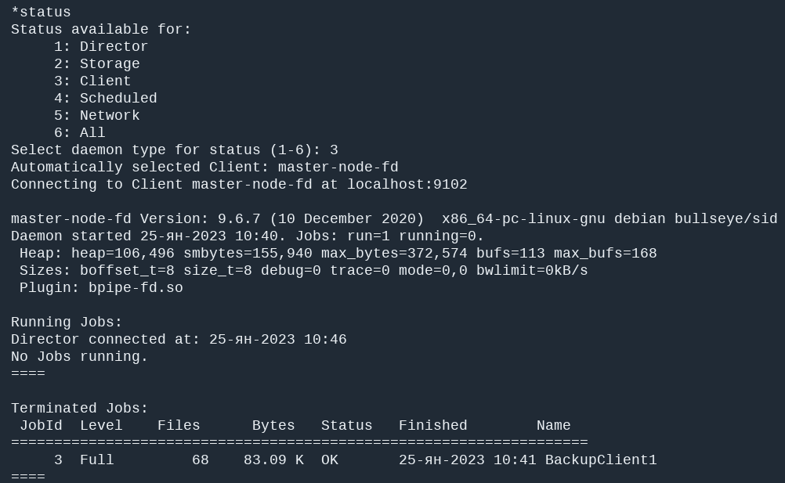
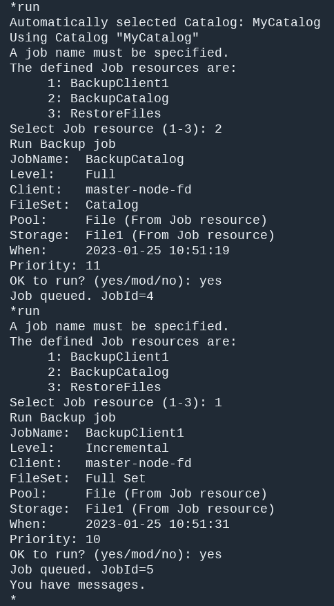
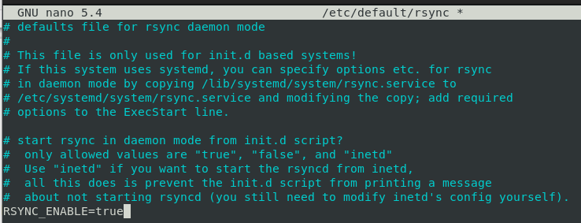

# Домашнее задание к занятию "Резервное копирование" - `Яринский Д.А.`

## Задание 1

В чём разница между:

- полным резервным копированием,
- дифференциальным резервным копированием,
- инкрементным резервным копированием.

**Приведите ответ в свободной форме.**

## Ответ:

 - **Полное или `Full BackUp`**:  Делает полное копирование всего при котором снимок операционной 
  системы, диска, раздела или отдельных папок содержит все резервируемые данные. Такие снимки, 
  создаваемые в рамках одной и той же задачи по бэкапу, независимы друг от друга, повреждение одного 
  из них никак не повлияет на другие снимки. Это самый надёжный метод резервного копирования, но, 
  вместе с тем, самый затратный по ресурсам дискового пространства;

 - **Дифференциальное**: Делает резервное копирование, при котором полная копия создаётся единожды в начале,
  а все последующие копии, создаваемые в рамках одной и той же задачи, содержат не все данные, а лишь
  произошедшие изменения с момента создания первичной полной копии. Ключевой момент здесь – с момента создания
  полной копии;

- **Инкрементное** – Делает резервное копирование, при котором полная копия создаётся единожды в начале, 
а все последующие копии, создаваемые в рамках одной и той же задачи, содержат не все данные, а лишь произошедшие
изменения - какие файлы удалены, а какие добавлены. Первая инкрементная копия содержит разницу в данных между
ней самой и полной копией. А вторая инкрементная копия содержит разницу между ней самой и первой инкрементной копией. Третья – между ней самой и второй. И так далее.

---

## Задание 2

Установите программное обеспечении Bacula, настройте bacula-dir, bacula-sd, bacula-fd. Протестируйте работу сервисов.

***Пришлите конфигурационные файлы для bacula-dir, bacula-sd, bacula-fd.**

## Ответ:

- Check List Config an ls

- Status

- List Jobs

- Run's

---

### Задание 3

Установите программное обеспечении Rsync. Настройте синхронизацию на двух нодах. Протестируйте работу сервиса.

**Пришлите рабочую конфигурацию сервера и клиента Rsync.**

## Ответ:

- rsync enable

- worker conf

- Script conf

- Status rsync

- Crontab

---

