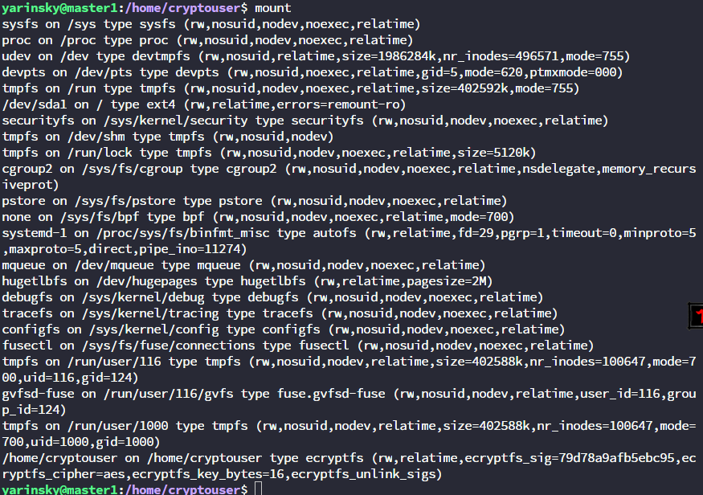
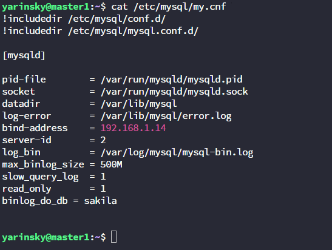

# Домашнее задание к занятию 12.3"`SQL. Часть 1`" - `Яринский Д.А.`

## Предисловие 

Я решил делать исключительно в консоли т.к. системный администратор в основном своё время проводит именно там, и нет возможности работы с графикой.

Для этого была создана папка в которой создавались исполняемые файлы запросов.

В каждом задании будет преведена ссылка на `sql` файлы

Для удобства все ссылки приведу тут:

| № Задания   | Ссылка на файл           | 
|:-----------:|:------------------------:|
| 1           | [Script_1](script/1.sql) |
| 2           | [Script_2](script/2.sql) |
| 3           | [Script_3](script/3.sql) |
| 4           | [Script_4](script/4.sql) |
| 5           | [Script_5](script/5.sql) |
| 6           | [Script_6](script/6.sql) |

Для этого была создана папка sys_15 - где будут нажы файлы запросов.
`/home/yarinsky/sys_15`

## Задание 1

Получите уникальные названия районов из таблицы с адресами, которые начинаются на “K” и заканчиваются на “a” и не содержат пробелов.

## Ответ:

Ссылка на sql файл: [Script_1](script/1.sql)

---

## Задание 2 ДОРАБОТКА

Получите из таблицы платежей за прокат фильмов информацию по платежам, которые выполнялись в промежуток с 15 июня 2005 года по 18 июня 2005 года включительно и стоимость которых превышает 10.00.

## Ответ:

### Прошу обратить `внимание` - что тут теперь в выводе дата в другом формате!

Ссылка на sql файл: [Script_2](script/2.sql)

---

## Задание 3 (С ПОПРАВКОЙ)

Получите последние пять аренд фильмов.

## Ответ:

Ссылка на sql файл: [Script_3](script/3.sql)

### ПРАВКА

Ссылка на sql файл: [Script_3](script/3.1.sql)

P.S. По другому что вы от меня хотите не понимаю.

---

## Задание 4

Одним запросом получите активных покупателей, имена которых Kelly или Willie.

Сформируйте вывод в результат таким образом:

- Все буквы в фамилии и имени из верхнего регистра переведите в нижний регистр,
- Замените буквы 'll' в именах на 'pp'.

## Ответ:

Ссылка на sql файл: [Script_4](script/4.sql)

---
## Дополнительные задания (со звездочкой*)

`Тут я решился ограничиться списом из 5 т.к в скриншот начало и конец не влезят.`

## Задание 5 *

Выведите Email каждого покупателя, разделив значение Email на две отдельных колонки: 
- в первой колонке должно быть значение, указанное до @, 
- во второй — значение, указанное после @.

## Ответ: 

Ссылка на sql файл: [Script_5](script/5.sql)

---

## Задание 6 *

Доработайте запрос из предыдущего задания, скорректируйте значения в новых колонках: первая буква должна быть заглавной, остальные — строчными.

## Ответ: 

Ссылка на sql файл: [Script_6](script/6.sql)

